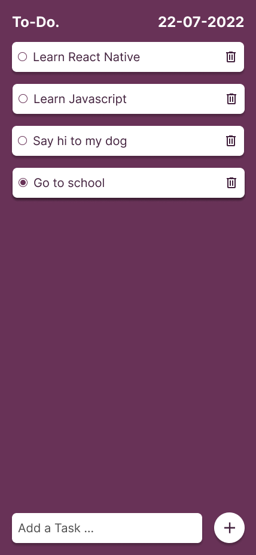

<h1 align="middle"> Todo </h1>

## Summary

* [Overview](#Overview)
* [Rules](#Rules)
* [Requirements](#requirements)
* [Bonus](#bonus)
* [Credits](#Credits)

## Overview
Let's create a Todo cross platform application.

## Rules

* You **MUST** create a directory named `todo`
* You **MUST** create a file called `.author`:
* You **MUST** return your project through [Google Drive](https://drive.google.com/drive/folders/1MT0OnqWwc2LrxJPnXWWZ30Gv7Xki5y9P?usp=sharing)
* You **MUST** create a directory `LAST_NAME FIRST_NAME` in the [Google Drive](https://drive.google.com/drive/folders/1MT0OnqWwc2LrxJPnXWWZ30Gv7Xki5y9P?usp=sharing)

```sh
~/efrei-courses/learn-react-native/exams/todo ❯❯❯ cat -e .author
[
  {
    "firstName": "Dylan",
    "lastName": "DE SOUSA"
  }
]
```

## Requirements

### Model

You **MUST** follow the model bellow.



### Specs

* ```22-07-2022``` has to show the date of today.
* ```Add a Task...``` is an input.
* Clicking on the ```+``` button will create a new item on the list, using the input value.
* Clicking on an ```Item``` will toggle the round button: ```°```.
* Clicking on the ```bin``` will remove the ```Item``` from the list.

### Bonus
Feel free to add anything you want. Here are a list of some bonus that you can do,

- Click on a Task to show details
- Add bottom navigation bar with settings
- Splash Screen

## Credits

Made by **Call-Me-Dev**
